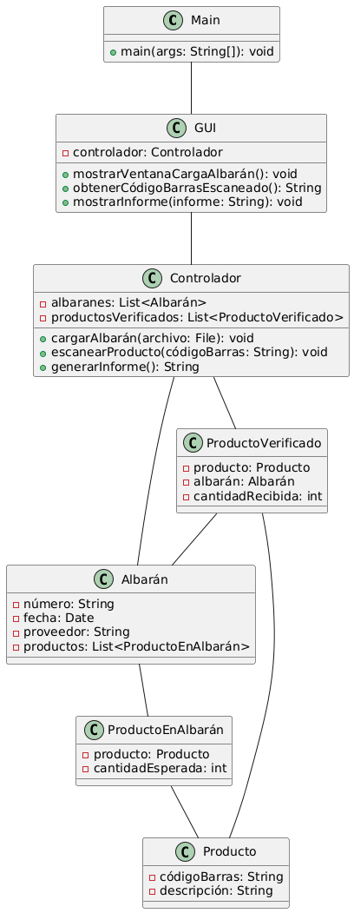

# ALBARANCHECK
## Proyecto de Desarrollo de Aplicaciones Multiplataformas

**Leonardo Manuel Méndez Pérez**
24/06/2024
C.F.G.S. DESARROLLO DE APLICACIONES MULTIPLATAFORMAS
Comunidad de Madrid - España

---

**Índice:**

1.  [INTRODUCCIÓN](#introducción)
    *   [Versión](#versión)
    *   [Tecnología](#tecnología)
    *   [Plataforma](#plataforma)
    *   [Objetivo](#objetivo)
    *   [Características](#características)
2.  [V 0.1: Prototipo Básico (Java sin frameworks)](#v-01-prototipo-básico-java-sin-frameworks)
    *   [1. Introducción](#1-introducción)
        *   [Descripción del problema y objetivos del proyecto.](#descripción-del-problema-y-objetivos-del-proyecto)
        *   [Alcance y limitaciones de esta versión.](#alcance-y-limitaciones-de-esta-versión)
    *   [2. Requisitos y Casos de Uso](#2-requisitos-y-casos-de-uso)
        *   [Requisitos Funcionales](#requisitos-funcionales)
        *   [Requisitos No Funcionales](#requisitos-no-funcionales)
        *   [Descripción detallada de los casos de uso principales.](#descripción-detallada-de-los-casos-de-uso-principales)
    *   [3. Diseño](#3-diseño)
        *   [Diagrama de clases (UML).](#diagrama-de-clases-uml)
        *   [Descripción de la estructura del código y los componentes principales.](#descripción-de-la-estructura-del-código-y-los-componentes-principales)
    *   [9. Implementación](#9-implementación)
        *   [Detalles de la implementación de cada componente.](#detalles-de-la-implementación-de-cada-componente)
        *   [Librerías y herramientas utilizadas.](#librerías-y-herramientas-utilizadas)
    *   [10. Pruebas y Resultados](#10-pruebas-y-resultados)
        *   [Pruebas unitarias y de integración realizadas.](#pruebas-unitarias-y-de-integración-realizadas)
        *   [Resultados de las pruebas y análisis de rendimiento.](#resultados-de-las-pruebas-y-análisis-de-rendimiento)
    *   [11. Conclusiones y Trabajo Futuro](#11-conclusiones-y-trabajo-futuro)
        *   [Resumen de los logros alcanzados en esta versión.](#resumen-de-los-logros-alcanzados-en-esta-versión)
        *   [Planificación para las siguientes versiones.](#planificación-para-las-siguientes-versiones)
3.  [V 0.2: Almacenamiento en Base de Datos (Java sin frameworks, MySQL/H2)](#v-02-almacenamiento-en-base-de-datos-java-sin-frameworks-mysqlh2)
    *   [1. Introducción](#1-introducción-1)
        *   [Objetivos de esta versión: persistencia de datos.](#objetivos-de-esta-versión-persistencia-de-datos)
    *   [2. Diseño de la Base de Datos](#2-diseño-de-la-base-de-datos)
        *   [Modelo entidad-relación (ER).](#modelo-entidad-relación-er)
        *   [Descripción de las tablas y relaciones.](#descripción-de-las-tablas-y-relaciones)
    *   [3. Implementación](#3-implementación-1)
        *   [Conexión a la base de datos.](#conexión-a-la-base-de-datos)
        *   [Consultas SQL para guardar y recuperar datos.](#consultas-sql-para-guardar-y-recuperar-datos)
        *   [Actualización de la interfaz de usuario para interactuar con la base de datos.](#actualización-de-la-interfaz-de-usuario-para-interactuar-con-la-base-de-datos)
    *   [4. Pruebas y Resultados](#4-pruebas-y-resultados)
        *   [Pruebas de la funcionalidad de la base de datos.](#pruebas-de-la-funcionalidad-de-la-base-de-datos)
        *   [Evaluación del rendimiento y optimización de consultas.](#evaluación-del-rendimiento-y-optimización-de-consultas)
4.  [V 0.3: Mapeo Objeto-Relacional (Java sin frameworks, MySQL, JPA)](#v-03-mapeo-objeto-relacional-java-sin-frameworks-mysql-jpa)
    *   [1. Introducción](#1-introducción-2)
        *   [Objetivos de esta versión: simplificar el acceso a la base de datos.](#objetivos-de-esta-versión-simplificar-el-acceso-a-la-base-de-datos)
    *   [2. Diseño con JPA](#2-diseño-con-jpa)
        *   [Entidades JPA y mapeo objeto-relacional.](#entidades-jpa-y-mapeo-objeto-relacional)
        *   [Repositorios JPA.](#repositorios-jpa)
    *   [3. Implementación](#3-implementación-2)
        *   [Integración de JPA en el código existente.](#integración-de-jpa-en-el-código-existente)
        *   [Refactorización del código para usar entidades y repositorios.](#refactorización-del-código-para-usar-entidades-y-repositorios)
        *   [Carga de albaranes en PDF (PDFBox).](#carga-de-albaranes-en-pdf-pdfbox)
    *   [4. Pruebas y Resultados](#4-pruebas-y-resultados-1)
        *   [Pruebas de la funcionalidad de JPA.](#pruebas-de-la-funcionalidad-de-jpa)
        *   [Evaluación del impacto en el rendimiento.](#evaluación-del-impacto-en-el-rendimiento)
5.  [V 0.4: Spring Boot y Spring Data JPA (Java, Spring Boot, MySQL)](#v-04-spring-boot-y-spring-data-jpa-java-spring-boot-mysql)
    *   [1. Introducción](#1-introducción-3)
        *   [Objetivos de esta versión: mejorar la estructura del proyecto.](#objetivos-de-esta-versión-mejorar-la-estructura-del-proyecto)
    *   [2. Configuración de Spring Boot](#2-configuración-de-spring-boot)
        *   [Dependencias y configuración inicial.](#dependencias-y-configuración-inicial)
        *   [Estructura del proyecto con Spring Boot.](#estructura-del-proyecto-con-spring-boot)
    *   [3. Implementación](#3-implementación-3)
        *   [Integración de Spring Data JPA.](#integración-de-spring-data-jpa)
        *   [Servicios y controladores para la lógica de negocio.](#servicios-y-controladores-para-la-lógica-de-negocio)
    *   [4. Pruebas y Resultados](#4-pruebas-y-resultados-2)
        *   [Pruebas de la funcionalidad de Spring Boot y Spring Data JPA.](#pruebas-de-la-funcionalidad-de-spring-boot-y-spring-data-jpa)
        *   [Evaluación del impacto en el rendimiento.](#evaluación-del-impacto-en-el-rendimiento)
6.  [V 1.0: Versión Web (Java, Spring Boot, Spring MVC/WebFlux, Thymeleaf/React/Angular, MySQL)](#v-10-versión-web-java-spring-boot-spring-mvcwebflux-thymeleafreactangular-mysql)
    *   [1. Introducción](#1-introducción-4)
        *   [Objetivos de esta versión: crear una interfaz web.](#objetivos-de-esta-versión-crear-una-interfaz-web)
    *   [2. Diseño de la Interfaz de Usuario](#2-diseño-de-la-interfaz-de-usuario)
        *   [Wireframes y prototipos.](#wireframes-y-prototipos)
        *   [Tecnologías de frontend (Thymeleaf, React o Angular).](#tecnologías-de-frontend-thymeleaf-react-o-angular)
    *   [3. Implementación](#3-implementación-4)
        *   [Controladores y vistas para la interfaz web.](#controladores-y-vistas-para-la-interfaz-web)
        *   [Autenticación de usuarios (opcional).](#autenticación-de-usuarios-opcional)
        *   [Escaneo de códigos de barras con JavaScript.](#escaneo-de-códigos-de-barras-con-javascript)
    *   [4. Pruebas y Resultados](#4-pruebas-y-resultados-3)
        *   [Pruebas de la funcionalidad de la interfaz web.](#pruebas-de-la-funcionalidad-de-la-interfaz-web)
        *   [Pruebas de usabilidad y experiencia de usuario.](#pruebas-de-usabilidad-y-experiencia-de-usuario)
        *   [Evaluación del rendimiento y optimización.](#evaluación-del-rendimiento-y-optimización)
7.  [V 2.0: Versión Móvil (Dart, Flutter, SQLite)](#v-20-versión-móvil-dart-flutter-sqlite)
    *   [1. Introducción](#1-introducción-5)
        *   [Objetivos de esta versión: crear una aplicación móvil nativa.](#objetivos-de-esta-versión-crear-una-aplicación-móvil-nativa)
    *   [2. Diseño de la Interfaz de Usuario](#2-diseño-de-la-interfaz-de-usuario-1)
        *   [Wireframes y prototipos para dispositivos móviles.](#wireframes-y-prototipos-para-dispositivos-móviles)
        *   [Diseño de la experiencia de usuario (UX) para móviles.](#diseño-de-la-experiencia-de-usuario-ux-para-móviles)
    *   [3. Implementación](#3-implementación-5)
        *   [Widgets y componentes de Flutter.](#widgets-y-componentes-de-flutter)
        *   [Acceso a la cámara y al lector de códigos de barras.](#acceso-a-la-cámara-y-al-lector-de-códigos-de-barras)
        *   [Almacenamiento local de datos en SQLite.](#almacenamiento-local-de-datos-en-sqlite)
        *   [Sincronización con la base de datos central (opcional).](#sincronización-con-la-base-de-datos-central-opcional)
    *   [4. Pruebas y Resultados](#4-pruebas-y-resultados-4)
        *   [Pruebas en dispositivos reales.](#pruebas-en-dispositivos-reales)
        *   [Pruebas de rendimiento y consumo de recursos.](#pruebas-de-rendimiento-y-consumo-de-recursos)
        *   [Publicación en la tienda de aplicaciones.](#publicación-en-la-tienda-de-aplicaciones)

---

## INTRODUCCIÓN

Como parte de mi camino educativo, he decidido desarrollar un proyecto completo para una aplicación con utilidad práctica y que cubra una necesidad actual en un grupo de empresas. La idea nace de mi experiencia como franquiciado de DIA y de la necesidad que he observado en los encargados de recepción en múltiples empresas.

El objetivo principal es recorrer todas las fases del diseño de software, utilizando diversas tecnologías en un único proyecto. Esto me permitirá evaluar las diferencias en cuanto al uso y aplicabilidad de cada tecnología según el contexto y tipo de proyecto.

Mi visión es crear una aplicación intuitiva y eficiente para la recepción de productos. La aplicación permitirá a los usuarios:

*   Cargar albaranes en formato PDF.
*   Escanear códigos de barras de productos o bultos.
*   Verificar si todos los productos del albarán han sido recibidos.

El sistema generará un informe detallado indicando los productos recibidos, faltantes o con errores. La aplicación final será accesible tanto en dispositivos Android como iOS, descargable desde las respectivas tiendas de aplicaciones, y podrá utilizarse con la cámara del dispositivo o un lector de códigos de barra Bluetooth. Para el análisis y extracción de los datos de los albaranes se utilizará una API de una IA.

Para lograr esto, seguiré un enfoque iterativo, desarrollando distintas versiones que evolucionarán en complejidad y funcionalidad:

| Versión | Tecnología                              | Plataforma   | Objetivo                                       | Características                                                                                           |
|---------|-----------------------------------------|--------------|------------------------------------------------|-----------------------------------------------------------------------------------------------------------|
| V 0.1   | Java (sin frameworks)                  | Escritorio   | Validar la idea y la funcionalidad principal   | Lectura de códigos de barras, comparación básica con el albarán (cargado manualmente como texto), informe simple de productos recibidos/faltantes |
| V 0.2   | Java (sin frameworks), MySQL           | Escritorio   | Almacenar datos de albaranes y recepciones     | Conexión a base de datos, consultas SQL básicas para guardar y recuperar datos                           |
| V 1.0   | Java (sin frameworks), MySQL, JPA      | Escritorio   | Simplificar el acceso a la base de datos       | Mapeo objeto-relacional con JPA, carga de albaranes en PDF, informe más completo                         |
| V 2.0   | Java con Spring Boot, Thymeleaf, JPA   | Web          | Hacer la aplicación accesible desde cualquier dispositivo | Interfaz web responsive, autenticación de usuarios, escaneo con lector Bluetooth                 |
| V 3.0   | FlutterFlow, Supabase, SQLite          | Android/iOS  | Ofrecer la mejor experiencia en móviles        | Interfaz para Android/iOS, acceso a cámara y lector Bluetooth, almacenamiento local y en la nube         |
| V 4.0   | Android Studio, SQLite                 | Android      | App nativa optimizada                          | Interfaz optimizada, uso de cámara y lector Bluetooth, almacenamiento local con SQLite                   |
| V 5.0   | IA, FlutterFlow, Supabase, SQLite      | Android/iOS  | Implementar IA para procesar albaranes         | Integración de API de IA para leer y procesar albaranes automáticamente                                  |

---

## V 0.1: Prototipo Básico (Java sin frameworks y sin persistencia)

### Introducción
El objetivo de este proyecto es desarrollar una aplicación de escritorio que permita gestionar la recepción de albaranes de entrega enviados por una compañía. Las principales funcionalidades del sistema incluyen:
- Permitir la carga de un archivo PDF que contenga el albarán.
- Leer y procesar el contenido del albarán para mostrar la información resumida en pantalla (número de albarán, fecha, proveedor, lista de productos y cantidades).
- Habilitar un campo para escanear los códigos de barras de los productos recibidos, generando una lista de productos verificados.
- Comparar los productos escaneados con la lista del albarán para identificar discrepancias.
- Emitir un informe final que detalle los productos recibidos, faltantes y discrepancias.

### Alcance y limitaciones
Esta versión inicial (V 0.1) tiene un alcance limitado:
- No se guardará un histórico de albaranes, verificaciones ni usuarios.
- La lista de productos con sus códigos EAN se almacenará en un archivo `.dat`.
- Sin persistencia en bases de datos.
- Sin manejo avanzado de excepciones.

### Requisitos Funcionales
- **RF.01**: Carga de albaranes en PDF.
- **RF.02**: Lectura y visualización del contenido del albarán.
- **RF.03**: Escaneo de códigos de barras.
- **RF.04**: Verificación de recepción.
- **RF.05**: Generación de informe de recepción.

### Requisitos No Funcionales
- **RNF.01**: Interfaz intuitiva y fácil de usar.
- **RNF.02**: Procesamiento rápido de albaranes y escaneo.
- **RNF.03**: Portabilidad en diferentes máquinas.

### Casos de Uso
1. **CU.01**: Cargar albarán.
2. **CU.02**: Ver albarán.
3. **CU.03**: Escanear producto.
4. **CU.04**: Verificar recepción.
5. **CU.05**: Generar informe.
6. **CU.06**: Exportar informe.

### Diseño
Diagrama de clases (UML) en PlantUML:

